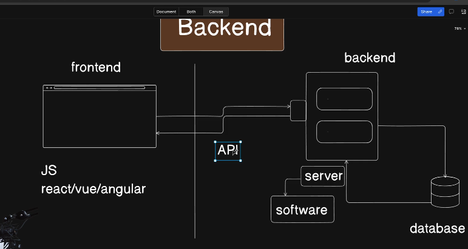
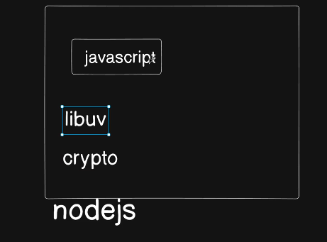
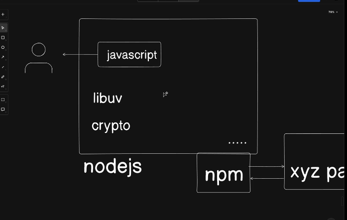

# NodeJS LibUV

initially we dont need that much node js as it is a very extensive area which can be explore very much in depth so rather than that we will foucs on firts building 5-10 projects then we can deep dive as per the requirements.

In Backend there is Server and DBs. 
simple backend is how DB interacts with the Server
Server is just a software. 
Server cannot listen to anything. Server consists of ports to which the frontend can talk to using an API

## there are many ways to write you server

* we can just write it in Javascript but there are problems. so we use NodeJS. but all the functionality of the NodeJS is not taken from JS from forn also 3rd party like LibUV (it is included in Node and this LibUV is a seperate beast on its own and is written in C)
  
  
  * there is another thing called a package manager that we use called npm ( it manages package like express and many more...)
  * Express is another web framework for node we use to create full stack application. (you can search it in npm)
  * 
  * nodejs code is availabe on GitHub