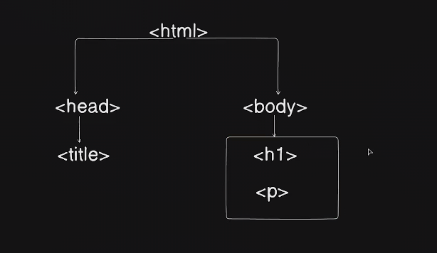

# What is HTML
hyper text markup language

it initially started as a way to share the information among each other

<html></html>

they behave exactly the same way in every browser

HTML is devided into 2 parts head and body denoted as <head> and <body>
* head contains the metadata 
* the body primarily contains the visible document or the page

`Read about things as I will not include these in notes as they are very tempting to write about but they dont contribute to the techincal knowledge but knowing this is also important so I will write them as questions.`

1. What is HTML ?
2. Web pages vs Web Applications ?
3. HTML tags ?
4. HTML document heirarchy ?
5. How Browser run HTML ?
6. Learn about meta tags and all that is in boilerplate code

-----------------------------------

## Emment
A plugin to improve HTML writing workflow.comes by default in vscode
`h1>lorem13 and then hit tab`

Important Keywords
* Tags(html)
* Elements(<h1>fdfdfd</h1>)
* Attrubute (width,tooltip,src)
* ToolTip
* Lists (ol,ul)
* Inline (image) and Block (headings,lists) Level Elements
* Container (div)
* Strong and em tag
* tag hierarchy

Questions 
1. Read about Emments 
2. Markdown and HTML corelation and difference ?
3. Relative path and absoulute path
4. Types of lists (ordered unordered )? there are 4 types basically
   
------------------------------------------

## Tables 
to show and share the research in early days
table table tag 
tr table row
th table data
td table data

Keywords

Questions 
## Forms
To Take data from users
* HTML
* Emails
* Password
* Files
* Colours

Questions 
* learn about id names etc understand what is used the formation of the flow
* Learn on the fly not everything you wont remember it anyway 

## Learn to Look up things no one rember those have a understanding of things rather than memorize

---------------------------------------
## Sementics 
how to wrap about and how to structure the website it is mentioned in MDN under `Document and website structure`
Before semnatics to clearly define the portions of the page we used to use div for everything.
The given below are not elements on their own but rather just containers
* header <header>
* navigation bar <nav>
* main content <main>
* Sidebar
* Footer

* Globat attributes