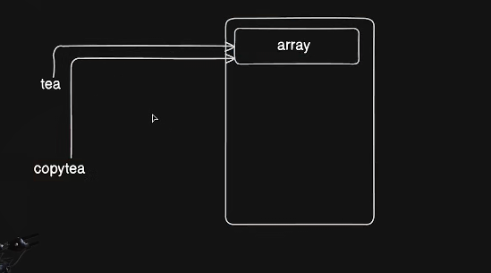
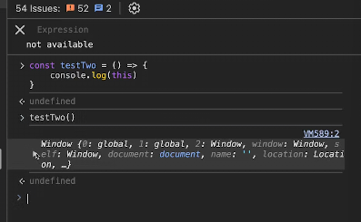

# Javascript
till now we have made dumb websites (i.e they dont do anything on their own)
They just have -:
- HTML
- CSS
- Tailwind
- and some Browser responsive 

`difference web pages and webapps` 

using JS we convert these webpages to web applications/apps. so they can be responsive or do something.
---
## 

we can go to inspect and go to console and run javascript there. this used to be the case previously. because there was no wa to run it outside of the browser console another way was write you javascript file and attach html file to that.

We need some kind of software like compiler or interpreter to conver this code and this has been the missing key and it was only present it in browser.
so we tried to extract that part of software from the browser so called `engine` so we can run it outside the browser. there were many engine before the `V8` but V8 was better and was backed by google and is an opensource high performace js and webassembly engine written in C++. 
'`learn technicality about it after some time`' 
then node js was introduced using the V8 engine after wrapping code around it as a javascript run time enviornment.

initially JS only role was to make the web pages interactive. but after the run time enviornment we could use it as a proper language for multipe use case.

as it is now a stand alone language to run it on server. so it was used for every kind of development
- frontend (reactjs)
- Backend (nodejs,nextjs)
- Desktop apps (electron)
- Mobile apps (react native)

## How JS execute the code

it was a simpe interpreted conversion previously 

code file-> software(interpreter)->output

### but now

Q1. what is parsing/tokenization ? 
Q2. syntax tree ?

this doesnt need to happen all at one but can occur for small project
then this goes to JIT Complier (like Java)

`standard engines are nodejs or deno but there are also other engines like JavaScriptCore and Bun`

----- 

## Datatypes variables constants in JS
we use console.log to debug the code

the value declared in var it allocates space in the memory 
but we use let for the recent operations rather than var

## Primitive and Non Primitve Data types

Non Primitves mostly contains objects.

every primitive can be converted to non primitive so in JS we can say all data types are objects.

## Conditionals

## array challenges

