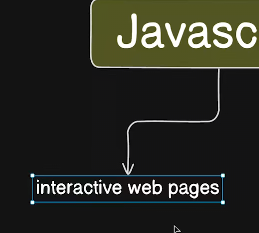

# Javascript
till now we have made dumb websites (i.e they dont do anything on their own)
They just have -:
- HTML
- CSS
- Tailwind
- and some Browser responsive 

`difference web pages and webapps` 

using JS we convert these webpages to web applications/apps. so they can be responsive or do something.
---
## 


we can go to inspect and go to console and run javascript there. this used to be the case previously. because there was no wa to run it outside of the browser console another way was write you javascript file and attach html file to that.

We need some kind of software like compiler or interpreter to conver this code and this has been the missing key and it was only present it in browser.
so we tried to extract that part of software from the browser so called `engine` so we can run it outside the browser. there were many engine before the `V8` but V8 was better and was backed by google and is an opensource high performace js and webassembly engine written in C++. 
'`learn technicality about it after some time`' 
then node js was introduced using the V8 engine after wrapping code around it as a javascript run time enviornment.



initially JS only role was to make the web pages interactive. but after the run time enviornment we could use it as a proper language for multipe use case.


as it is now a stand alone language to run it on server. so it was used for every kind of development
- frontend (reactjs)
- Backend (nodejs,nextjs)
- Desktop apps (electron)
- Mobile apps (react native)


## How JS execute the code


it was a simpe interpreted conversion previously 

code file-> software(interpreter)->output

### but now

Q1. what is parsing/tokenization ? 
Q2. syntax tree ?


this doesnt need to happen all at one but can occur for small project
then this goes to JIT Complier (like Java)


`standard engines are nodejs or deno but there are also other engines like JavaScriptCore and Bun`

----- 

## Datatypes variables constants in JS
we use console.log to debug the code


the value declared in var it allocates space in the memory 
but we use let for the recent operations rather than var


## Primitive and Non Primitve Data types


Non Primitves mostly contains objects.


every primitive can be converted to non primitive so in JS we can say all data types are objects.


## Conditionals


## array challenges


## Functions

ques 2 


[Javascript execution context](https://www.freecodecamp.org/news/how-javascript-works-behind-the-scene-javascript-execution-context/)

ques 3 
arrow function


the whole theory about arrow this function is not true actually 
it has it but not the ability to pass it to anywhere

## Ques 5 
This JavaScript code demonstrates **closures**, a powerful concept where an inner function has access to the variables of its outer function, even after the outer function has finished executing. Let me explain how it works step by step:

---

### Code Breakdown:

1. **Outer Function: `createTeaMaker`**
   ```javascript
   function createTeaMaker(name) {
       let score = 100;
       return function (teaType) {
           return `Making ${teaType} ${name} ${score}`;
       };
   }
   ```
   - The function `createTeaMaker` takes one parameter: `name`.
   - Inside this function, a variable `score` is initialized with the value `100`.
   - It returns **an inner function** that takes one parameter: `teaType`. This inner function uses the `name` and `score` variables from the outer function to create a string.

2. **Closure:**
   - When the `createTeaMaker` function is called, it doesn’t just execute the code inside and return; it creates a **closure**.
   - The returned inner function retains access to the variables in the outer function (`name` and `score`), even after `createTeaMaker` has finished executing.

---

### Usage:

1. **Calling the Outer Function:**
   ```javascript
   let teaMaker = createTeaMaker("hitesh");
   ```
   - The `createTeaMaker` function is called with the argument `"hitesh"`. 
   - Inside `createTeaMaker`, the variable `name` is set to `"hitesh"`, and `score` is initialized to `100`.
   - The function then returns the **inner function**, which is stored in the variable `teaMaker`.

2. **Calling the Inner Function:**
   ```javascript
   let result = teaMaker("green tea");
   ```
   - Here, the `teaMaker` variable (which holds the inner function) is called with the argument `"green tea"`.
   - The inner function accesses the variables `name` (`"hitesh"`) and `score` (`100`) from the closure and uses the parameter `teaType` (`"green tea"`) to construct the string.

3. **Output:**
   ```javascript
   console.log(result);
   ```
   - The `result` variable now contains the string `"Making green tea hitesh 100"`, which is logged to the console.

---

### Key Concepts in Action:

1. **Lexical Scope:**
   - The inner function can access variables from its outer function (`name` and `score`) because of lexical scoping.

2. **Closure:**
   - Even though `createTeaMaker` has finished executing, the inner function retains access to its variables (`name` and `score`) due to the closure.

3. **Dynamic Reusability:**
   - The `createTeaMaker` function allows you to create multiple tea makers, each with its own `name` and `score`. For example:
     ```javascript
     let anotherTeaMaker = createTeaMaker("rahul");
     console.log(anotherTeaMaker("black tea")); // Making black tea rahul 100
     ```

---

### Why is it Working?

1. **Closures Keep the State:**
   - When the outer function `createTeaMaker` is executed, it creates a new execution context with `name` and `score`. This context is preserved by the closure, allowing the inner function to access these variables.

2. **Inner Function Can Use Outer Variables:**
   - Even though `createTeaMaker` has already returned, the variables `name` and `score` are still accessible to the inner function because of the closure.

---

### Output:

```javascript
Making green tea hitesh 100
```

---

This code pattern is commonly used to create **factories**, **encapsulation**, and **function currying**. It’s a great example of how closures make JavaScript functions so powerful and flexible!