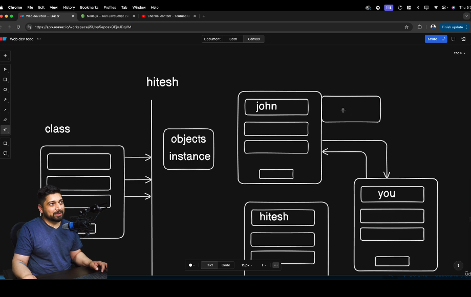
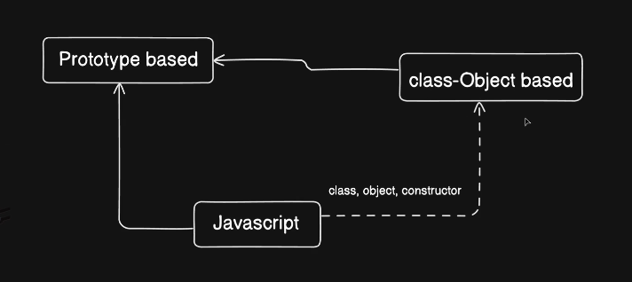
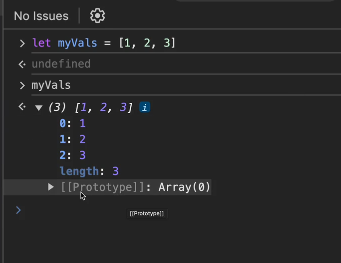
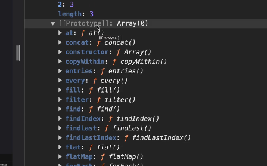
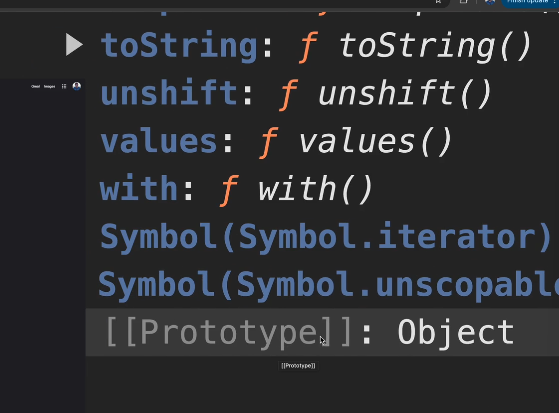
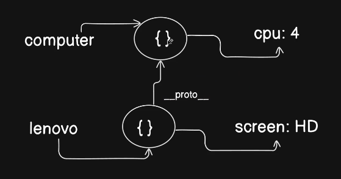
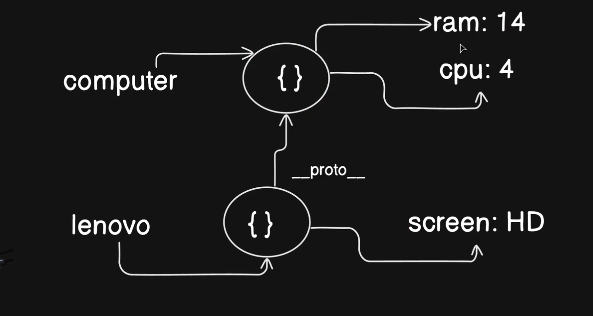

object/ instance 
class
object oriented programming language 

## OOPS

In javaxript there is prototype based programming and Class - Object based
initally it was only a Prototype based programming language then syntax sugar got added which made it into Class Object based using keywords like class object constructor.
we are pretending it is class object based but it does prototype based and masked 

Everything you do in JS is prototype based.

we can see this prototype keyword by runing any js code in console browser and when it is expanded we can see

